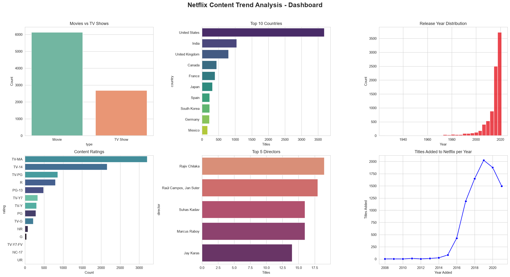
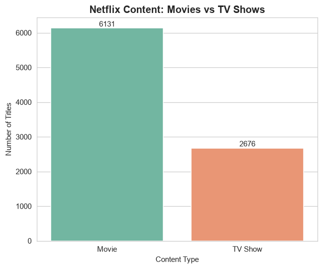
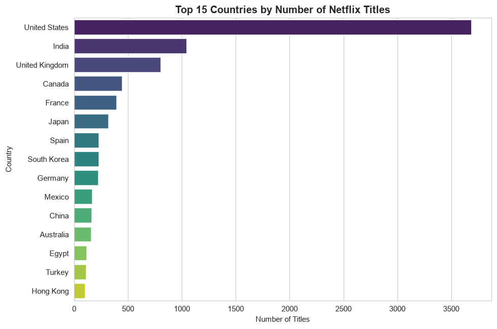
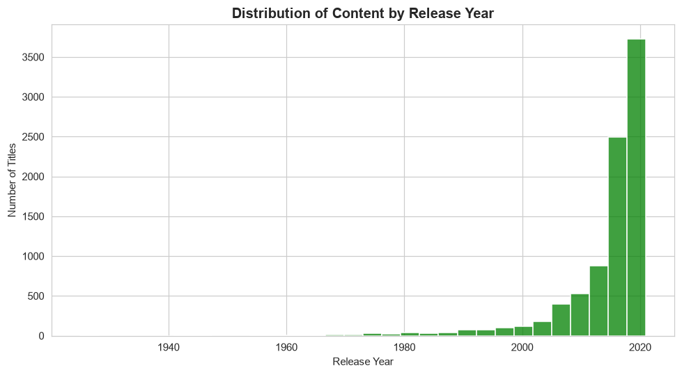
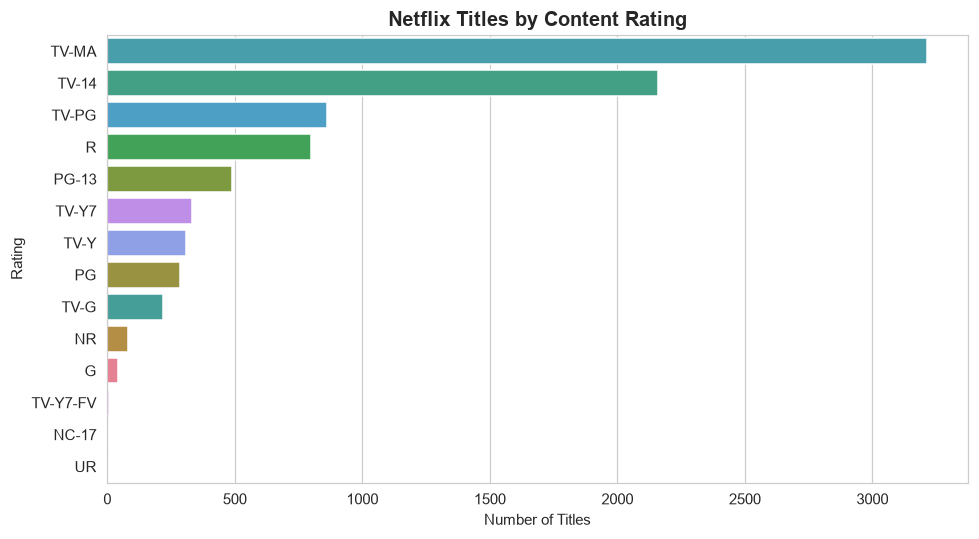
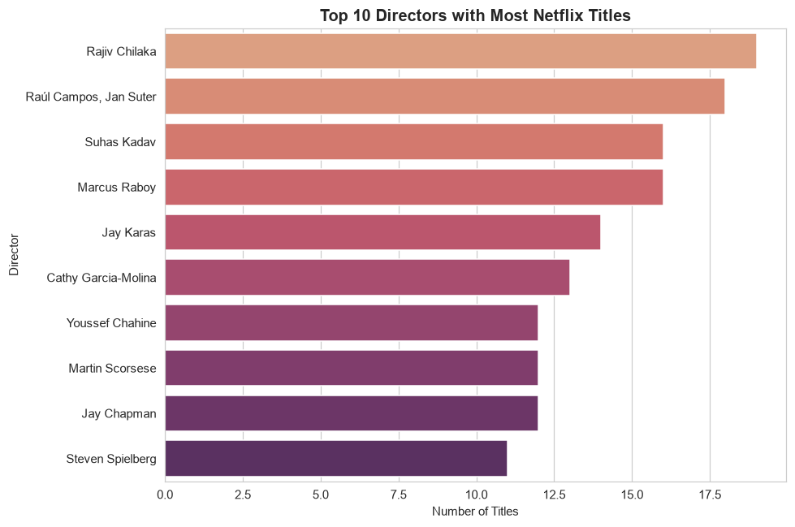
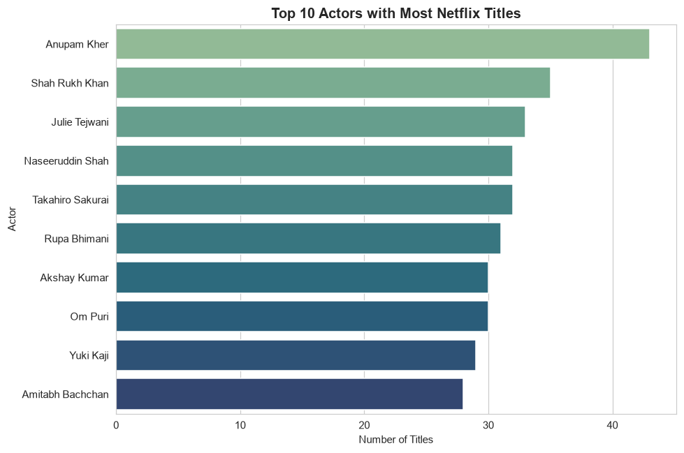
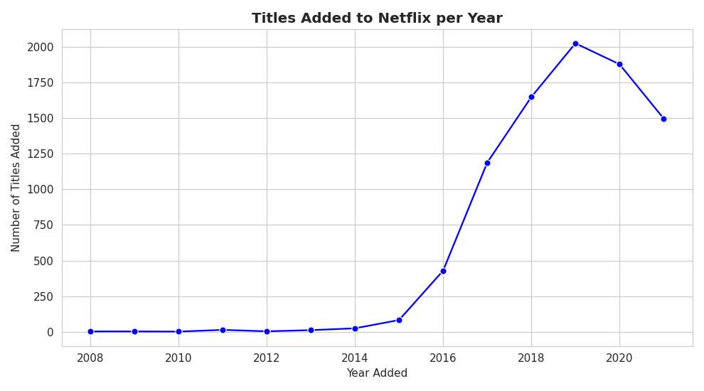

# Netflix Content Trend Analysis | Python

A data cleaning and visualization project that analyzes Netflix's catalog to understand content type, country, release year, ratings, and the most prolific creators.



## Problem Statement
In the competitive OTT market, understanding content trends supports business decisions. The raw Netflix dataset is messy, so this project cleans it and uses visualizations to uncover patterns in content type, country, release year, and genre.

## Dataset
- **Source file:** `netflix_titles.csv`
- **Size:** 8,807 titles, 12 columns
- **Columns:** show_id, type, title, director, cast, country, date_added, release_year, rating, duration, listed_in, description

## Project Workflow
| Module | Work Done |
|---|---|
| 1. Data Loading | Inspected shape, data types, and duplicates |
| 2. Missing Values | Filled director, cast, country with "Unknown"; filled date_added and rating using the mode; fixed rows where rating and duration were swapped |
| 3. Data Types | Converted date_added to datetime, release_year to int, type/rating/country to category |
| 4. Univariate EDA | Type, country, release year, and rating charts |
| 5. Advanced Visualization | Top 10 directors and actors |
| 6. Dashboard | 6-chart dashboard with business insights |

## Visualizations

<table>
  <tr>
    <td></td>
    <td></td>
  </tr>
  <tr>
    <td></td>
    <td></td>
  </tr>
  <tr>
    <td></td>
    <td></td>
  </tr>
  <tr>
    <td></td>
    <td></td>
  <tr>
    <td></td>
    <td></td>
  </tr>
</table>

## Key Insights
1. **Movies dominate:** about 70% of titles are movies and 30% are TV shows
2. **The US leads:** about 42% of titles are linked to the United States, followed by India and the UK
3. **Rapid growth:** titles added peaked in 2019 (about 2,000), followed by 2020
4. **Mature content leads:** TV-MA is the most common rating (about 36%)
5. **International focus:** "International Movies" is the top genre tag, and creators like Rajiv Chilaka, Anupam Kher, and Shah Rukh Khan appear most often

## Conclusion
Netflix's catalog is movie-heavy, anchored in the US but increasingly international, scaled up rapidly in a short window, and skews toward mature-rated content. These insights can inform content acquisition, licensing, and regional investment strategy.

## Tools Used
Python • Pandas • NumPy • Matplotlib • Seaborn • Jupyter Notebook

## Repository Structure

├── notebooks/   # Jupyter notebook
├── data/        # Raw and cleaned datasets
├── images/      # Chart images
├── docs/        # Project brief
└── README.md


## How to Run
```bash
pip install pandas numpy matplotlib seaborn jupyter
jupyter notebook notebooks/netflix_content_trend_analysis.ipynb
```

## Author
**Prashanth Udidi**
Data Analytics | Python | SQL | Power BI | Excel
[LinkedIn](https://www.linkedin.com/in/your-profile) • [GitHub](https://github.com/udidiprashanth-alt)
